# Available AI Tools

This document catalogs all available AI tools, automation workflows, and agent skills in this project. It serves as a single source of truth for project automation infrastructure, helping you understand which capabilities are available and how they're organized.

The inventory is automatically discovered from:
- **`skills-lock.json`** — Open-source skills and their sources
- **`.claude/skills/`** — Custom project-specific skills
- **`.claude/settings.json`** — Enabled agent plugins

---

## 🛠️ Custom Skills

Custom skills are project-specific tools created by your team for this repository. They extend core Claude Code functionality with automation workflows tailored to your development process.

| Skill | Type | Description |
|-------|------|-------------|
| **git-branch** | Git workflow | Manage git branch creation, switching, and workflows with semantic versioning support |
| **github-mcp-setup** | GitHub integration | Configure GitHub Model Context Protocol (MCP) server for Claude Code integration with GitHub repositories, PR management, and issue tracking |
| **js-project-structure** | Project analysis | Analyze and understand JavaScript/TypeScript project structure, dependencies, and architecture |
| **pr** | GitHub workflow | Agent-driven GitHub PR creation workflow aligned with semantic-release conventions; validate commits, generate PR titles and bodies, and manage PR creation with human approval |
| **semantic-release** | Release workflow | Create git branches and conventional commits aligned with semantic-release for automated versioning and changelog generation |
| **skill-creator** | Skill development | Create new skills, modify and improve existing skills, and measure skill performance with evals and benchmarks |

---

## 📦 Open-source Skills

Open-source skills are maintained in external repositories and installed into this project. They provide battle-tested capabilities and receive regular updates from their source projects.

| Skill | Source | Description |
|-------|--------|-------------|
| **document-ai** | [mrbalov/ai](https://github.com/mrbalov/ai) | Discovers all available AI tools (skills, hooks, agents) and generates comprehensive AI.md with inventory, decision trees, and Agent Tools Graph showing automation infrastructure and document dependencies |
| **frontend-design** | [anthropics/skills](https://github.com/anthropics/skills) | Design system documentation and frontend UI component documentation generation |

---

## 🤖 Agent Skills

Agent skills from enabled plugins provide specialized capabilities for complex tasks. These integrate with Claude Code's agent system.

| Skill | Plugin | Description |
|-------|--------|-------------|
| **agent-skills** | addy-agent-skills | Comprehensive suite of agent-driven workflows covering code review, testing, planning, implementation, security, documentation, and more |

---

## 🎯 Decision Trees

Common workflows and when to use each AI tool:

### For Development & Implementation
- **Starting new work**: Use `semantic-release` → create branch and conventional commits
- **Managing git workflows**: Use `git-branch` → branch management with semantic versioning
- **Understanding project structure**: Use `js-project-structure` → analyze JavaScript/TypeScript projects

### For Code Quality & Review
- **Code review**: Use `agent-skills` (code-reviewer) → comprehensive review across correctness, readability, architecture, security, performance
- **Testing**: Use `agent-skills` (test-engineer) → test strategy, writing tests, coverage analysis

### For GitHub & Collaboration
- **Setting up GitHub integration**: Use `github-mcp-setup` → configure MCP server for GitHub operations
- **Creating pull requests**: Use `pr` → agent-driven PR workflow with semantic-release alignment
- **Managing releases**: Use `semantic-release` → conventional commits for automated versioning

### For Skill Development & Documentation
- **Building custom skills**: Use `skill-creator` → create, modify, and benchmark new skills
- **Documenting AI infrastructure**: Use `document-ai` → generate comprehensive AI.md (this file)

---

## 🔗 Agent Tools Graph

### Graph Legend
- 🛠️ **Custom Skill** (Teal) — Project-specific automation
- 📦 **Open-source Skill** (Orange) — External maintained skill
- 🤖 **Agent Skill** (Green) — Plugin-provided agent capability
- 💡 **Group** — Skill category or workflow family

### Skill Relationships

```mermaid
graph TD
    subgraph Custom["🛠️ Custom Skills"]
        GB["<b>git-branch</b><br/>Git workflow management"]
        GMS["<b>github-mcp-setup</b><br/>GitHub MCP configuration"]
        JPS["<b>js-project-structure</b><br/>Project analysis"]
        PR["<b>pr</b><br/>PR workflow"]
        SR["<b>semantic-release</b><br/>Release workflow"]
        SC["<b>skill-creator</b><br/>Skill development"]
    end
    
    subgraph OpenSource["📦 Open-source Skills"]
        DAI["<b>document-ai</b><br/>AI tools documentation"]
        FD["<b>frontend-design</b><br/>Design documentation"]
    end
    
    subgraph AgentSkills["🤖 Agent Skills"]
        AS["<b>agent-skills</b><br/>Comprehensive agent<br/>workflows"]
    end
    
    subgraph Workflows["🔄 Common Workflows"]
        W1["Development & Release"]
        W2["Code Quality"]
        W3["GitHub Collaboration"]
        W4["Documentation"]
    end
    
    GB -->|branch creation| W1
    SR -->|conventional commits| W1
    PR -->|PR creation| W3
    GMS -->|GitHub setup| W3
    AS -->|code review| W2
    AS -->|testing| W2
    SC -->|skill ops| W4
    DAI -->|docs generation| W4
    FD -->|design docs| W4
    JPS -->|project analysis| W1
    
    style GB fill:#80cbc4,stroke:#00897b,color:#000,stroke-width:2px
    style GMS fill:#80cbc4,stroke:#00897b,color:#000,stroke-width:2px
    style JPS fill:#80cbc4,stroke:#00897b,color:#000,stroke-width:2px
    style PR fill:#80cbc4,stroke:#00897b,color:#000,stroke-width:2px
    style SR fill:#80cbc4,stroke:#00897b,color:#000,stroke-width:2px
    style SC fill:#80cbc4,stroke:#00897b,color:#000,stroke-width:2px
    
    style DAI fill:#ffe0b2,stroke:#f57c00,color:#000,stroke-width:2px
    style FD fill:#ffe0b2,stroke:#f57c00,color:#000,stroke-width:2px
    
    style AS fill:#c8e6c9,stroke:#388e3c,color:#000,stroke-width:2px
    
    style W1 fill:#f3e5f5,stroke:#7b1fa2,color:#000
    style W2 fill:#f3e5f5,stroke:#7b1fa2,color:#000
    style W3 fill:#f3e5f5,stroke:#7b1fa2,color:#000
    style W4 fill:#f3e5f5,stroke:#7b1fa2,color:#000
```

---

## 📋 Skills Inventory Summary

| Category | Count | Details |
|----------|-------|---------|
| **Custom Skills** | 6 | git-branch, github-mcp-setup, js-project-structure, pr, semantic-release, skill-creator |
| **Open-source Skills** | 2 | document-ai, frontend-design |
| **Agent Skills** | 1 | agent-skills (addy-agent-skills plugin) |
| **Total AI Tools** | 9+ | Plus specialized sub-skills within agent-skills plugin |

---

## 🚀 Quick Start by Task

### I want to...

**...create a new feature branch**
→ Use `git-branch` skill

**...write and commit code with semantic versioning**
→ Use `semantic-release` skill for conventional commits

**...create a pull request**
→ Use `pr` skill (integrates with semantic-release)

**...set up GitHub integration**
→ Use `github-mcp-setup` skill

**...review code for bugs and quality**
→ Use `agent-skills:code-reviewer` agent

**...write comprehensive tests**
→ Use `agent-skills:test-engineer` agent

**...analyze my JavaScript project structure**
→ Use `js-project-structure` skill

**...create custom skills**
→ Use `skill-creator` skill with evals and benchmarking

**...generate project documentation**
→ Use `document-ai` skill (for AI tools) or `frontend-design` skill (for UI components)

---

## 📚 Platform & Architecture

### Platform
- **Platform**: Claude Code (Claude-based development environment)
- **Configuration**: `.claude/settings.json`
- **Plugin System**: Enabled (agent-skills@addy-agent-skills)

### Skill Discovery
- **Skills Lock**: `skills-lock.json` (source of truth for open-source skills)
- **Local Skills Directory**: `.claude/skills/`
- **Settings**: `.claude/settings.json` (agent plugins)

### Deduplication Strategy
Each skill appears in exactly ONE category:
1. Open-source (if in `skills-lock.json`) — highest priority
2. Custom (if in `.claude/skills/` and not in lock file)
3. Agent Skill (if from enabled plugins)

---

## ✅ Reference & Maintenance

**Last Generated**: 2026-06-18

**To regenerate this file**, use the `document-ai` skill:
- Automatically discovers all skills from current project state
- Validates all references and tool configurations
- Updates decision trees based on available skills
- Completely regenerates from scratch (no stale data)

**For detailed information on any skill**, navigate to its directory in `.claude/skills/` and read the `SKILL.md` file.

---

## 🔗 Related Documentation

- **Skill Development**: See `.claude/skills/skill-creator/SKILL.md`
- **AI Tools Discovery**: See `.claude/skills/document-ai/SKILL.md`
- **Semantic Versioning**: See `.claude/skills/semantic-release/SKILL.md`
- **GitHub Integration**: See `.claude/skills/github-mcp-setup/SKILL.md`
- **Project Configuration**: See `.claude/settings.json`
